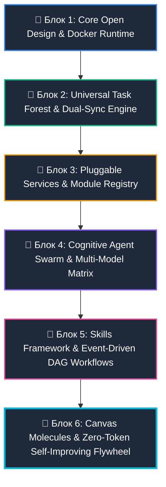
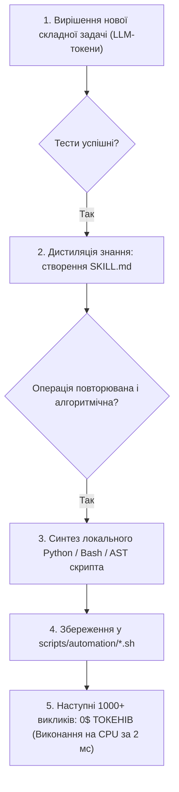

# --- DNK-MRH-HEADER ---
# mrh_id: "DNKOS_MVP/docs/tech/ARCH_01_Grand_Blueprint.md"
# purpose: "Canonical documentation and task tracking note"
# canonical_source: true
# alters_files: []
# triggers_tasks: []
# status: "Active"
# version: "1.0.0"
# updated_at: "2026-08-09"
# --- END DNK-MRH-HEADER ---

# 🏛️ DNK OS: Генеральний Архітектурний Блупрінт (Grand Architectural Blueprint)
**Версія:** 2.0.0-CANONICAL  
**Дата:** 2026-08-08  
**Архітектори:** Antigravity (Lead Architect & Mentor), Maxim (Visionary Owner), Hermes/Gerych (Chief Builder)  
**Статус:** Канонічний Стандарт Системи (Active System Standard)

---

## 🎯 1. Візія та Фундаментальні Принципи (Core Principles)

DNK OS — це **Agent-Native Self-Evolving Ecosystem** (Агентно-Орієнтована Самовдосконалювана Операційна Система), побудована на базі нескінченного візуального полотна, децентралізованих сервісів, рою автономних агентів та інноваційного механізму **Zero-Token Flywheel** (перетворення розв'язаних задач у безкоштовні локальні скрипти).

```
┌─────────────────────────────────────────────────────────────────────────────┐
│                             DNK OS ECOSYSTEM                                │
├─────────────────────────────────────────────────────────────────────────────┤
│ 1. VISUAL WORKSPACE: Infinite Canvas (Open Design + React Flow + iFrame)   │
├─────────────────────────────────────────────────────────────────────────────┤
│ 2. DUAL TASK FOREST: 5-Plant Scale for Developers & Business Operations     │
├─────────────────────────────────────────────────────────────────────────────┤
│ 3. MODULAR SERVICES: Pluggable microservices via service_manifest.yaml       │
├─────────────────────────────────────────────────────────────────────────────┤
│ 4. SOTA AGENT SWARM: 5-Layer Intelligence Matrix (Soul/Router/Memory/Tools) │
├─────────────────────────────────────────────────────────────────────────────┤
│ 5. EVENT-DRIVEN DAG: Visual Workflows & Token-Efficient SKILL.md Framework  │
├─────────────────────────────────────────────────────────────────────────────┤
│ 6. CANVAS MOLECULES: 5-Atom Interactive Units (State/Brain/View/Ctrl/Tool)  │
├─────────────────────────────────────────────────────────────────────────────┤
│ 7. ZERO-TOKEN ENGINE: Task ➔ Skill Distillation ➔ Local CPU Script (0$ Cost)│
└─────────────────────────────────────────────────────────────────────────────┘
```

---

## 🌿 2. Архітектурне Розбиття на 6 Дерев Реалізації (6 Epic Trees)

Для послідовної та бездоганної розробки система розділена на **6 ізольованих епічних блоків (Дерев)**. Кожен блок реалізується в окремій сесії розробки.



---

## 🌳 БЛОК 1: Core Open Design & Docker Runtime
**Мета:** Надійне, чисте середовище розробки без забруднення хост-машини (Zero Host Pollution) та базовий візуальний шелл.

### Ключові компоненти:
1. **Dockerized Dev Stack (`docker-compose.dev.yml`)**:
   - Повна ізоляція `node_modules`, `.next`, Python рантаймів та білд-кешів в анонімних томах Docker.
   - Запуск Fastify Daemon (порт 8080) та Next.js Web UI (порт 3001).
2. **Open Design Web Shell (`apps/web`)**:
   - Інтеграція `@xyflow/react` для побудови нескінченного полотна.
   - Пісочний iFrame (`IFrameCanvasNode`) з ізоляцією `sandbox="allow-scripts allow-same-origin"`.
3. **Двостороння шина подій (Event Bus)**:
   - FastAPI / Fastify WebSocket `/ws/canvas_sync` для потокової передачі стану.
   - `postMessage` контракт між полотном та живим прев'ю.

---

## 🌳 БЛОК 2: Universal Task Forest & Dual-Sync Engine
**Мета:** Двостороння система планування для розробки коду та бізнес-задач клієнтів за 5-рівневою біологічною моделлю.

### 5-Рівнева Таксономія (5-Plant Scale):
1. **`01_Fields` (Поле)**: Загальне поле системи або бренд клієнта (напр. `Field_DNKOS_MVP.md`).
2. **`02_Sectors` (Сектор)**: Напрямок діяльності (Core, Shopify, Content, Marketing, Ads, SEO).
3. **`03_Trees` (Дерево/Епік)**: Великий модуль або довгострокова ціль.
4. **`04_Bushes` (Кущ/Фіча)**: Кластер взаємопов'язаних задач або пайплайн.
5. **`05_Flowers` (Квітка/Таск)**: Атомарна дія зі статусами: `Брунька (Todo)` ➔ `Цвіт (In Progress)` ➔ `Плід (Completed)`.

### Архітектура Dual-Sync:
* **Git Source of Truth**: Markdown-файли з YAML-метаданими у `docs/tasks/`.
* **Fast Reactive Cache**: PostgreSQL/Redis таблиці `cross_repo_nodes` та `tasks` для рендерингу за 1 мс.
* **LOD Viewport Virtualization**: Зум 10-30% рендерить Поля/Сектори; 30-70% — Кущі; 70-100% — активні квіти.

---

## 🌳 БЛОК 3: Pluggable Services & Module Registry
**Мета:** Модульна архітектура підключення сервісів до ядра DNK OS без модифікації базового коду.

### Стандарт модуля `service_manifest.yaml`:
```yaml
id: dnk_shopify_builder
name: "DNK Shopify Agent Builder"
version: "1.0.0"
entrypoint: "services/shopify/main.py"
api_routes:
  - path: "/api/v1/shopify/customizer"
    method: "POST"
canvas_nodes:
  - type: "ShopifyCustomizerNode"
    component: "components/ShopifyCustomizerNode.jsx"
required_skills:
  - "liquid-schema-parsing"
  - "shopify-theme-tokens"
```

### Принципи роботи:
* `ServiceRegistry` автоматично реєструє нові сервіси під час старту.
* Кожен сервіс надає власний REST/WebSocket API та візуальну ноду для полотна.
* Сервіси спілкуються через внутрішню шину Redis Pub/Sub або gRPC/FastAPI IPC.

---

## 🌳 БЛОК 4: Cognitive Agent Swarm & Multi-Model Matrix
**Мета:** Фабрика високоінтелектуальних агентів з роутингом моделей та спеціалізацією.

### 5-Шарів Інтелекту Агента:
```
┌─────────────────────────────────────────────────────────────┐
│ 1. SOUL LAYER (Характер, принципи, менторські настанови)    │
├─────────────────────────────────────────────────────────────┤
│ 2. COGNITIVE ROUTER (NVIDIA NIM / Multi-Model Hub)          │
│    • Mistral Codestral ➔ Блискавичний синтаксис та код     │
│    • GLM 5.2 / Claude 3.5 Sonnet ➔ Логіка та архітектура    │
│    • DeepSeek R1 / Gemini 1.5 Pro ➔ Складні міркування      │
├─────────────────────────────────────────────────────────────┤
│ 3. MEMORY & CONTEXT (HNSW pgvector + FTS + Mem0 сесії)     │
├─────────────────────────────────────────────────────────────┤
│ 4. HANDS & TOOLS (MCP-інструменти, Docker, File I/O, CLI)   │
├─────────────────────────────────────────────────────────────┤
│ 5. VERIFIER & REFLEXION (Self-Critic перед погодженням)     │
└─────────────────────────────────────────────────────────────┘
```

### Рольова матриця агентів:
* **Antigravity**: Головний Архітектор, Ментор, Продукт-директор.
* **Hermes (Gerych)**: Головний Будівельник, Менеджер коду, виклики інструментів.
* **Tiffany**: Маркетолог, креативний копірайтер, генератор текстів.
* **Cas**: Аналітик бізнесу, аудитор воронок, парсер конкурентів.
* **Morgan**: Трейдер, таргетолог, менеджер автоматизації постів.

---

## 🌳 БЛОК 5: Skills Framework & Event-Driven DAG Workflows
**Мета:** Економічний контекстний менеджмент та візуальні пайплайни завдань.

### 1. Фреймворк Навичок (`SKILL.md`):
* Динамічне підвантаження: навичка потрапляє в контекст **тільки за тригером** (Token-Efficient RAG).
* Файлова структура:
  ```
  .agents/skills/<skill_name>/
  ├── SKILL.md         # YAML Frontmatter + Інструкція
  ├── scripts/         # Допоміжні утиліти
  ├── examples/        # Еталонні зразки виводу
  └── references/      # Додаткова документація
  ```

### 2. Подієві DAG-Воркфлоу:
* Візуальний конструктор ланцюжків на полотні.
* Вузли: `Trigger (Клієнтський бриф / Вебхук)` ➔ `Аудит (Cas)` ➔ `Тексти (Tiffany)` ➔ `Рендер Сторінки (Gerych)` ➔ `Human Approval` ➔ `Публікація`.
* Підтримка асинхронного та паралельного виконання роїв агентів.

---

## 🌳 БЛОК 6: Canvas Molecules & Zero-Token Flywheel
**Мета:** Робочі одиниці полотна та петля самовдосконалення, що перетворює розв'язані задачі у безкоштовні локальні скрипти.

### 1. Робоча Молекула Полотна (Canvas Molecule):
Кожен інтерактивний блок — це 5-атомна одиниця:
* **State Atom**: Реактивний стейт (Zustand + PostgreSQL).
* **Cognitive Atom**: Підключений Агент або промпт-шаблон.
* **View/iFrame Atom**: Живе візуальне прев'ю артефакту.
* **Control Atom**: Динамічні контролери інспектора.
* **Tool/Action Atom**: CLI утиліта або API-дія.

### 2. Флайвіл Самовдосконалення (Zero-Token Flywheel):


---

## 📅 3. План Посесійного Виконання (Session Execution Roadmap)

| Сесія | Цільовий Блок | Головний результат сесії |
| :--- | :--- | :--- |
| **Сесія 1** | 🌳 **Блок 1: Core Open Design & Docker** | Живе контейнеризоване середовище та iFrame-шина |
| **Сесія 2** | 🌳 **Блок 2: Task Forest & Dual-Sync** | Повний 5-Plant Scale граф у PostgreSQL та React Flow |
| **Сесія 3** | 🌳 **Блок 3: Pluggable Services** | ServiceRegistry та стандарт `service_manifest.yaml` |
| **Сесія 4** | 🌳 **Блок 4: Cognitive Agent Swarm** | 5-шарова матриця агентів та фабрика архетипів |
| **Сесія 5** | 🌳 **Блок 5: Skills & DAG Workflows** | Динамічний RAG навичок та візуальний конструктор воркфлоу |
| **Сесія 6** | 🌳 **Блок 6: Molecules & Zero-Token Engine** | 5-атомні молекули та автокомпіляція безтокенних скриптів |

---
*Документ збережено в канонічній системі DNK OS.*