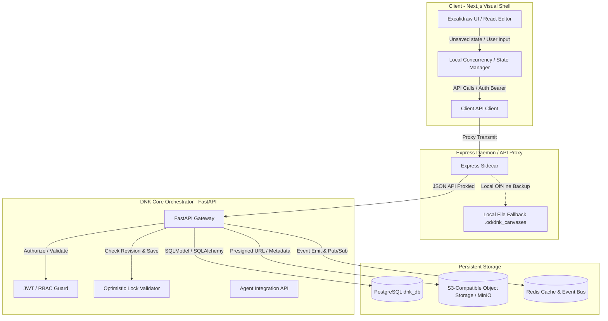
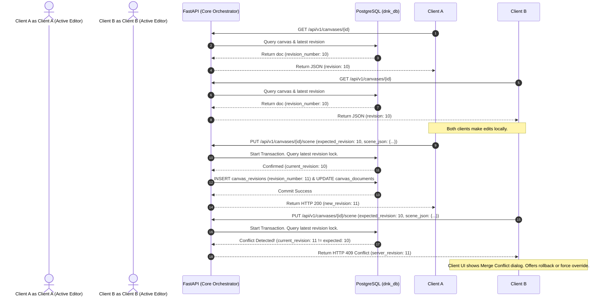

# --- DNK-MRH-HEADER ---
# mrh_id: "DNKOS_MVP/docs/specs/DNK_CANVAS_ARCHITECTURE.md"
# purpose: "Architecture Specification for Embedded DNK Canvas"
# canonical_source: true
# status: "Active"
# version: "1.0.0"
# updated_at: "2026-08-11"
# author: "DNK-e.com Maksym"
# license: "MIT"
# --- END DNK-MRH-HEADER ---

# 🏛️ DNK OS ARCHITECTURE SPECIFICATION: EMBEDDED DNK CANVAS

## 1. System Overview

The **DNK Canvas** is an embedded, persistent, multi-user visual collaboration layer within DNK OS, optimized for competitive analysis, strategic ideation, and visual mapping. It replaces the external Excalidraw-based workflow with an in-house, secure, and resilient infrastructure.

The core objective is to wrap the official `@excalidraw/excalidraw` component as a pure UI/Editor layer while offloading authentication, permission logic, versioning, object storage, asset caching, audit logs, and Task Forest integration to the DNK OS FastAPI Core and PostgreSQL.

### Key Capabilities
- **Persistent Backend Sovereignty**: No browser-cache-only data. All operations sync back to DNK OS servers.
- **Rich Task & Entity Linking**: Map specific canvas elements to Competitor profiles, evidence screenshots, task Flowers, ADRs, or active Agent Runs.
- **Agent Interactivity**: Allows specialized AI agent swarms to read, append elements to, and generate complete diagrams inside the active Canvas.
- **Revision Control & Integrity**: Checksum-verified incremental snapshotting with optimistic concurrency locking to prevent silent client overwrites.

---

## 2. Component Architecture

The visual canvas system follows a decoupled, three-tier service layout:

### Components Description
1. **Client Layer (Next.js)**: Embeds `@excalidraw/excalidraw` in a sandboxed Route (`/workspace/{workspace_id}/canvas/{canvas_id}`). Implements debounced autosaving, manual saving, keyboard shortcuts, local dirty state tracking, and export-to-file logic.
2. **Local Sidecar (Express Daemon)**: Acts as a local transit gateway for the client. Translates, forwards, and proxies requests, handles static assets pre-processing (such as resizing and security validation of binary images), and manages local fallback-persistence for zero-connectivity situations.
3. **Core Orchestrator (FastAPI)**: Serves as the primary source of truth for all business and validation logic. Standardizes schema validation via Pydantic, performs optimistic locking checks on document revisions, generates pre-signed S3 upload URLs, and integrates with the AI Agent Swarm.
4. **Storage Layer**:
   - **PostgreSQL**: Stores relational metadata, links, audit tracks, and revision scene JSON blobs.
   - **S3 / MinIO**: Hosts raw high-resolution binary assets (screenshots, evidence attachments) referenced by the canvas via hash-based content addresses (`sha256`).
   - **Redis**: Provides real-time synchronization, locks caching, and event broadcasting to the Express Daemon via Redis Pub/Sub.

---

## 3. Core Workflows & Sequencing

### 3.1. Document Save & Concurrency Flow (Optimistic Locking)

To prevent the **Silent Overwrite Problem** where Client B unknowingly wipes out changes made by Client A, the server implements strict **Optimistic Concurrency Control (OCC)** based on a monotonically increasing revision index (`revision_number`).

### 3.2. Binary Asset Ingestion (MinIO / S3 Integration)

Large binary assets (such as screenshots) must not be directly embedded in the canvas scene JSON as base64 strings because they catastrophically degrade PostgreSQL performance and inflate memory footprints. Instead, they are decoupled:

1. Client triggers an "Add Screenshot" action.
2. Client requests a pre-signed S3 upload URL via `POST /api/v1/canvases/{id}/assets/presign`.
3. FastAPI generates a unique `storage_key` using a SHA-256 hash of the incoming metadata, checks if the SHA-256 already exists in `canvas_assets` (deduplication check), and returns the upload URL.
4. Client uploads the raw binary file directly to S3/MinIO.
5. S3 upload finishes. Client calls FastAPI to commit the asset: `POST /api/v1/canvases/{id}/assets/commit`.
6. Client inserts a reference element in the Excalidraw scene JSON containing the `asset_id` instead of raw base64.

---

## 4. Agentic Interaction Architecture

The DNK OS Agent Swarm interacts with the canvas programmatically using standard tool calls routed through FastAPI.

### Dynamic Router Model Matrix
For agent operations on the canvas, the Chief Orchestrator delegates tasks dynamically using the following router matrix:
- **Design & Layout Synthesis** (`dnk-dev-01`): GLM-5.2 (`z-ai/glm-5.2`) - optimized for UI layout generation and React-side adaptations.
- **JSON Scene Manipulation** (`dnk_koder`): Codestral 22B (`mistralai/codestral-22b-instruct-v0.1`) - specialized in precise code modifications, algorithmic scene node generation, and geometry calculations.
- **Task Linkage & Governance** (`dnk_governance_companion`): Gemma-4 31B (`google/gemma-4-31b-it`) - handles MRH compliance, license verification, policy checks, and workspace constraints.

### Mutation Gates & Safety Guard
- **Read Operations**: Free. Agents can inspect the current scene to extract insights and competitors.
- **Append Mutations**: Handled by adding non-destructive elements (e.g. annotations, comments, linked nodes). Runs under the agent's identity with an automatic audit trail entry.
- **Destructive Mutations** (Overwriting complete canvas, deleting assets, rollback to ancient revisions): **Requires Supervisor Approval**. Any call to a destructive mutation endpoint triggers an interactive Slack/Telegram Supervisor Approval Gate via the `dnk_governance_companion`.

---

## 5. Security & Authorization Matrix

| Actor / Client | Role | Authorization Level | Permitted Operations |
| :--- | :--- | :--- | :--- |
| **Workspace Admin** | Owner | Read, Write, Delete, Share | Create, modify, delete documents, manage revisions, view audit trails, execute rollbacks. |
| **Workspace Peer** | Collaborator | Read, Write | Create, modify documents, view revisions, create links. No deletion. |
| **AI Sub-Agent** | Automated Bot | Appending Only (Token Scoped) | Query current state, append annotation/notes, link insights, commit asset. No destructive operations. |
| **Supervisor Gate** | Governance Board | Override / Approval | Authorize destructive mutations initiated by agents. |

Authentication is governed strictly via JWT tokens validated at the FastAPI core, preventing unauthorized cross-workspace operations.
