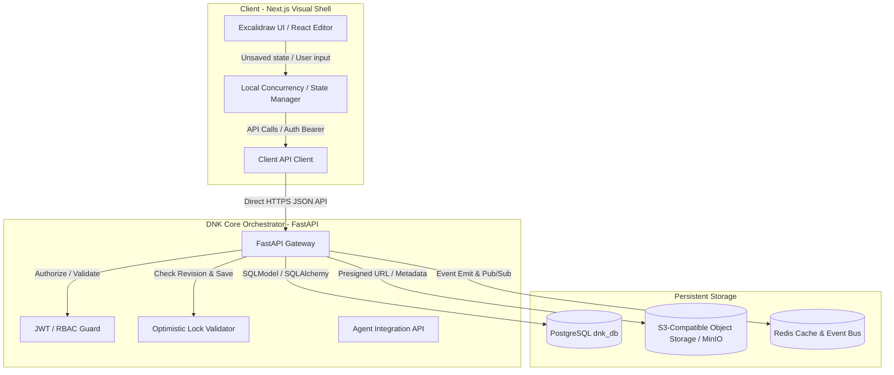
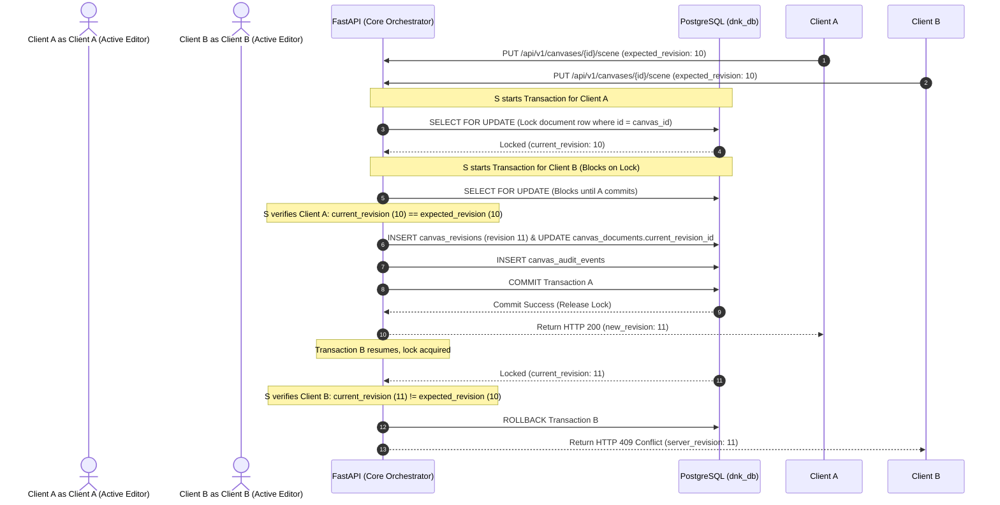

# --- DNK-MRH-HEADER ---
# mrh_id: "DNKOS_MVP/docs/specs/DNK_CANVAS_ARCHITECTURE.md"
# purpose: "Architecture Specification for Embedded DNK Canvas"
# canonical_source: true
# status: "Active"
# version: "1.1.0"
# updated_at: "2026-08-11"
# author: "DNK-e.com Maksym"
# license: "DNK-INTERNAL"
# --- END DNK-MRH-HEADER ---

# 🏛️ DNK OS ARCHITECTURE SPECIFICATION: EMBEDDED DNK CANVAS

## 1. System Overview

The **DNK Canvas** is an embedded, persistent, visual collaboration layer within DNK OS, optimized for competitive analysis, strategic ideation, and visual mapping. It replaces the external Excalidraw-based workflow with an in-house, secure, and resilient infrastructure.

The core objective is to wrap the official `@excalidraw/excalidraw` component as a pure UI/Editor layer while offloading authentication, permission logic, versioning, object storage, asset caching, audit logs, and Task Forest integration directly to the DNK OS FastAPI Core and PostgreSQL.

### Key Capabilities
- **Persistent Backend Sovereignty**: No browser-cache-only data. All operations sync back to DNK OS servers.
- **Rich Task & Entity Linking**: Map specific canvas elements (nodes) to Competitor profiles, evidence screenshots, task Flowers, ADRs, or active Agent Runs.
- **Agent Interactivity**: Allows specialized AI agent swarms to read, append elements to, and generate complete diagrams inside the active Canvas.
- **Revision Control & Integrity**: Checksum-verified incremental snapshotting with transaction-safe optimistic concurrency locking to prevent silent client overwrites.

---

## 2. Component Architecture

For Phase 1 (Persistence MVP) and Phase 2/3 (Links & Agent Integration), the architecture is direct, removing any intermediate sidecar proxies on the communication critical path to reduce failure modes and auth boundaries:

### Components Description
1. **Client Layer (Next.js)**: Embeds `@excalidraw/excalidraw` in a sandboxed Route (`/workspace/{workspace_id}/canvas/{canvas_id}`). Implements debounced autosaving, manual saving, keyboard shortcuts, local dirty state tracking, and export-to-file logic.
2. **Core Orchestrator (FastAPI)**: Serves as the primary source of truth for all business and validation logic. Standardizes schema validation via Pydantic, performs transaction-safe optimistic locking checks on document revisions, generates pre-signed S3 upload URLs, and integrates with the AI Agent Swarm.
3. **Storage Layer**:
   - **PostgreSQL**: Stores relational metadata, links, audit tracks, and revision scene JSON blobs.
   - **S3 / MinIO**: Hosts raw high-resolution binary assets (screenshots, evidence attachments) referenced by the canvas via hash-based content addresses (`sha256`).
   - **Redis**: Provides real-time synchronization, locks caching, and event broadcasting.

*Note on Sidecar Daemon*: The Express Sidecar Daemon is deferred to Phase 4 / future offline-local runtime ADR, and is completely omitted from the active communication path of Phase 1-3.

---

## 3. Core Workflows & Sequencing

### 3.1. Document Save & Concurrency Flow (Transaction-Safe OCC)

To eliminate the **Silent Overwrite Problem**, the system implements a strict **Optimistic Concurrency Control (OCC)** locking strategy. To prevent race conditions where two clients pass validation concurrently, FastAPI uses PostgreSQL row-level locks (`SELECT FOR UPDATE`).

### 3.2. Binary Asset Ingestion & Lifecycle (MinIO / S3 Integration)

To prevent database bloat, large screenshots are saved in S3 with a strict status tracking lifecycle:
`pending_upload ➔ uploaded ➔ verified`.

1. Client requests a pre-signed URL: `POST /api/v1/canvases/{id}/assets/presign` supplying file `sha256` and metadata.
2. FastAPI queries if `sha256` already exists:
   - **If exists with status `verified`**: FastAPI returns the existing `asset_id` and storage details immediately (zero duplicate upload).
   - **If absent**: FastAPI creates a record in `canvas_assets` with status `pending_upload`, generates a presigned URL, and returns it.
3. Client uploads the raw binary file directly to S3.
4. Client calls `POST /api/v1/canvases/{id}/assets/commit` verifying the upload.
5. FastAPI performs a background check to confirm the file size and mime type, updating the status to `verified`.

---

## 4. Agentic Interaction Architecture

The DNK OS Agent Swarm interacts with the canvas programmatically using standard tool calls routed through FastAPI.

### Dynamic Router Model Matrix
- **Geometry & Node Generation**: Delegated to `dnk_koder` (`mistralai/codestral-22b-instruct-v0.1`), leveraging its coding proficiency for algorithmic layout synthesis and JSON structures.
- **UI Adapters & Component Mapping**: Handled by `dnk-dev-01` (`z-ai/glm-5.2`), maximizing its front-end responsiveness and HTML/CSS structure comprehension.
- **Rule Enforcement & Policy Audit**: Directed through `dnk_governance_companion` (`google/gemma-4-31b-it`), ensuring all generated files and logs respect the MRH headers, licenses, and workspace boundaries.

### Safety Mutation Gate
- **Programmatic Appends**: Permitted automatically under the agent's token-scoped credentials with an active audit log.
- **Destructive mutations or Force-Commits**: Strictly blocked. Attempting to force-overwrite, delete elements, or bypass revision conflicts triggers the **Supervisor Approval Gate**, requiring explicit human-in-the-loop authorization via Slack/Telegram interactive callbacks before commit.

---

## 5. Security & Authorization Matrix

| Actor / Client | Role | Authorization Level | Permitted Operations |
| :--- | :--- | :--- | :--- |
| **Workspace Admin** | Owner | Read, Write, Delete, Share | Create, modify, delete documents, manage revisions, view audit trails, execute rollbacks. |
| **Workspace Peer** | Collaborator | Read, Write | Create, modify documents, view revisions, create links. No deletion. |
| **AI Sub-Agent** | Automated Bot | Appending Only (Token Scoped) | Query current state, append annotation/notes, link insights, commit asset. No destructive operations. |
| **Supervisor Gate** | Governance Board | Override / Approval | Authorize destructive mutations or force-commits initiated by agents or peers. |
