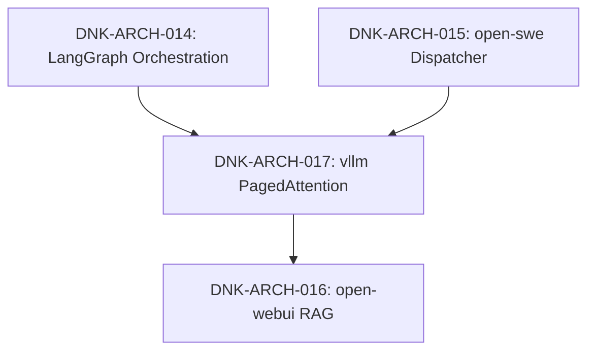

# DNK OS Pattern Dependency Graph

## Visual Map (Mermaid)

## Dependencies Table
| Pattern | Depends On | Conflicts With | Notes |
|---------|------------|----------------|-------|
| **DNK-ARCH-014** (LangGraph Orchestration) | — | — | Core agent graph execution framework |
| **DNK-ARCH-015** (open-swe Dispatcher) | — | — | Asynchronous task scheduling and worker dispatch |
| **DNK-ARCH-016** (open-webui RAG Pipeline) | DNK-ARCH-017 | — | RAG pipeline & user chat UI; requires LLM gateway |
| **DNK-ARCH-017** (vllm PagedAttention) | DNK-ARCH-014 | CPU-only deployment | High-throughput GPU inference gateway; requires CUDA 12.1+ |

## Pattern Governance Rules
1. Every new pattern must declare its upstream dependencies and potential hardware/runtime conflicts.
2. Cycles in the dependency graph are strictly prohibited.
3. Breaking changes in core orchestration (DNK-ARCH-014) require regression testing across all dependent nodes (015, 016, 017).
